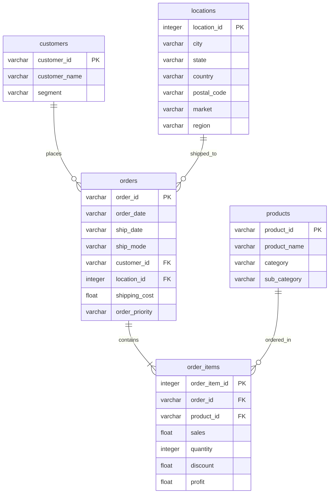
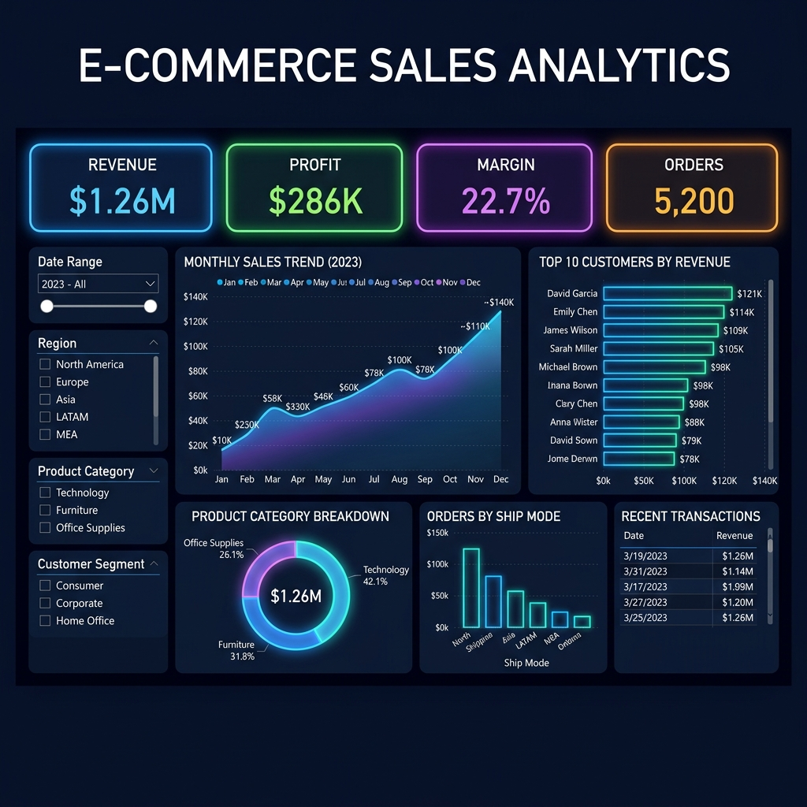

# AI-Powered Sales Analytics Assistant

A complete end-to-end Business Intelligence (BI) and AI analytics application. This project cleans and normalizes a high-volume sales dataset (~50,000+ records), loads it into a relational database, performs advanced SQL calculations (CTEs, Joins, Window Functions), outlines a Power BI data model, and runs a **Streamlit Web Application** featuring an **AI Query Assistant** that translates natural language questions into database-executable SQL using the **Gemini API**.

---

## 🚀 Key Features

*   **Data Engineering**: Programmatically downloads and cleans the Global Superstore sales dataset (combining and standardizing dates, numeric strings, and handling missing items) and normalizes it from a flat CSV format into a normalized star schema (`customers`, `products`, `locations`, `orders`, and `order_items`).
*   **Relational Database**: Populates a local SQLite database with relational indexes for fast execution, and provides production-ready schema scripts compatible with PostgreSQL and MySQL.
*   **Advanced Analytical SQL**: Implements business queries using SQL Joins, Common Table Expressions (CTEs), and Window Functions (`LAG` for MoM growth, `DENSE_RANK` for category contributions, and running totals).
*   **Power BI Integration**: Includes a database-to-Power BI schema relationship map, recommended DAX measures, and a custom dark-mode UI layout mockup.
*   **Executive Streamlit App**: A modern, dark-themed dashboard showing:
    *   Dynamic filters (Year, Market Region, Segment) that update KPIs and charts.
    *   Interactive Plotly visual graphs (Sales/Profit MoM trends, Category breakdowns, Top Customers, Best-selling items).
*   **AI SQL Assistant**: Integrates with the Google Gemini API to translate natural language user questions (e.g., *"Show me the top 5 customers"* or *"What were the sales in March 2014?"*) into database queries, executes them, and returns tabular data accompanied by an analyst-grade written summary.

---

## 📐 Relational Database Schema

The flat dataset is normalized into the following relational structure:



---

## 📂 Project Structure

```
ai-powered-sales-analytics-assistant/
│
├── data/
│   ├── raw_sales_data.csv       # Original downloaded dataset (~13MB)
│   ├── cleaned_*.csv            # Normalized dimension/fact CSV files
│   └── sales.db                 # Local SQLite database
│
├── sql/
│   ├── schema.sql               # Production PostgreSQL/MySQL schema definitions
│   └── queries.sql              # Core analytical business queries
│
├── src/
│   ├── data_loader.py           # Ingestion, cleaning, and normalization script
│   ├── ai_agent.py              # LLM-to-SQL agent using Gemini API
│   ├── app.py                   # Streamlit multi-page dashboard application
│   └── test_system.py           # Automated unit/integration tests
│
├── power_bi/
│   ├── mockups/
│   │   └── sales_dashboard_mockup.png # Dashboard visualization mockup
│   └── data_model_guide.md      # Data model mapping and DAX calculations
│
├── .env.example                 # Template environment configuration
├── requirements.txt             # Python packages
└── README.md                    # This document
```

---

## 🛠️ Getting Started

### Prerequisites

Ensure you have Python 3.10+ and Git installed on your system.

### 1. Installation

Clone this repository or navigate into the project directory and install the dependencies:

```bash
pip install -r requirements.txt
```

### 2. Ingest and Normalize Data

Execute the data loader script to download the Global Superstore CSV, clean it, split it into relational tables, and load it into a local SQLite database:

```bash
python src/data_loader.py
```

### 3. Set Up API Credentials

Copy the `.env.example` file to `.env` and fill in your Gemini API key:

```env
GEMINI_API_KEY=your_actual_gemini_api_key_here
```

> **Note**: If `GEMINI_API_KEY` is not provided, the Streamlit AI Query Assistant will run in an offline **Simulation Mode** using pre-configured mock questions to showcase features.

### 4. Run Automated System Tests

Verify that database tables, schemas, relations, and the AI agent translation loop are functioning correctly:

```bash
python src/test_system.py
```

### 5. Launch the Streamlit Web App

Start the dashboard web application:

```bash
streamlit run src/app.py
```

Open `http://localhost:8501` in your browser.

---

## 💻 Power BI Visualization Dashboard

The normalized files saved in the `data/` folder are formatted and ready for import. Replicate the visual mapping described in the [Power BI Guide](power_bi/data_model_guide.md) to build the dashboard.

Below is the visual mockup of the completed Power BI Dashboard:



---

## 👥 GitHub Upload Instructions

To upload this project to your GitHub repository:
1. Initialize a git repository locally:
   ```bash
   git init
   ```
2. Create a `.gitignore` to avoid committing large raw database files and keys:
   ```bash
   echo "data/raw_sales_data.csv" >> .gitignore
   echo "data/sales.db" >> .gitignore
   echo ".env" >> .gitignore
   echo "__pycache__/" >> .gitignore
   echo ".streamlit/" >> .gitignore
   ```
3. Stage and commit files:
   ```bash
   git add .
   git commit -m "Initial commit: AI-Powered Sales Analytics Assistant"
   ```
4. Push to your remote repository:
   ```bash
   git remote add origin https://github.com/yourusername/ai-powered-sales-analytics-assistant.git
   git branch -M main
   git push -u origin main
   ```
